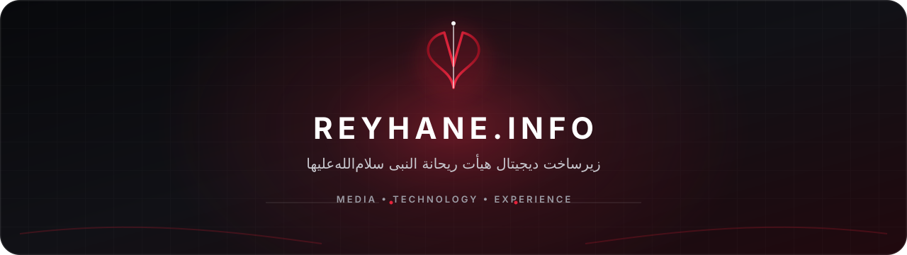

  

<h1 align="center">Reyhane Al-Nabi Organization</h1>

  An integrated digital platform for managing, publishing, and experiencing religious media.

  <a href="https://reyhane.info/">Website</a>
  &nbsp;&nbsp;•&nbsp;&nbsp;
  <a href="mailto:noc@reyhane.info">Technical Contact</a>

## About

Reyhane.info builds the digital infrastructure behind Reyhane Al-Nabi. Our platform helps teams capture ceremonies, organize long-term archives, publish audio and video, and deliver a fast and accessible experience to the audience.

We design the complete workflow as one connected system—from media intake and editorial operations to search, playback, analytics, mobile applications, and platform reliability.

## What We Build

<table>
  <tr>
    <td width="50%" valign="top">
      <h3>Media Operations</h3>
      
Structured workflows for ceremonies, audio recordings, images, videos, music videos, albums, and editorial publishing.

    </td>
    <td width="50%" valign="top">
      <h3>Archive and Discovery</h3>
      
Reliable categorization, fast indexing, Persian-aware search, and long-term access to ceremony media.

    </td>
  </tr>
  <tr>
    <td width="50%" valign="top">
      <h3>Digital Experiences</h3>
      
Responsive interfaces, mobile applications, PWA experiences, custom media players, and RTL-first product design.

    </td>
    <td width="50%" valign="top">
      <h3>Platform Engineering</h3>
      
REST APIs, publishing automation, media analytics, performance optimization, caching, and secure administration tools.

    </td>
  </tr>
</table>

## Engineering Principles

- **RTL-first by design** — Persian language support is part of the architecture, not an afterthought.
- **Privacy and security** — Minimal data collection, scoped access, and secure delivery are built into every layer.
- **Measurable performance** — Fast experiences, deliberate caching, and attention to Core Web Vitals.
- **Accessibility** — Keyboard support, reduced-motion behavior, semantic structure, and inclusive interactions.
- **Maintainability** — Modular systems, clear documentation, versioned releases, and reversible operations.

## Technology

`WordPress` · `PHP` · `JavaScript` · `React` · `Python` · `Django` · `Kotlin` · `Java` · `REST APIs` · `PWA` · `Elementor`

## Repository Access

Product repositories are kept private during active development and deployment. Authorized organization members have access to source code, technical documentation, and versioned releases.

Private repositories do not mean inactive projects. The platform is developed, tested, and released continuously through internal workflows.

## Contact

- Website: [reyhane.info](https://reyhane.info/)
- Technical contact: [noc@reyhane.info](mailto:noc@reyhane.info)
- GitHub: [@reyhane-info](https://github.com/reyhane-info)

---

  Built with care for the long-term preservation and delivery of ceremony media.

